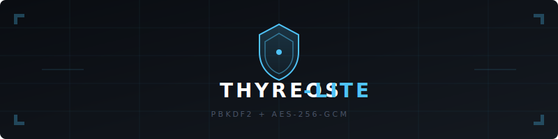

<div align="center">
  
  <br><br>

  
  
  
  

  <h3>🛡️ Browser-Based File Encryption for Educational Purposes</h3>
  <p><em>All cryptographic operations run locally in your browser. No files ever leave your device.</em></p>
</div>

---

> ⚠️ **EDUCATIONAL DISCLAIMER**
> 
> **This project is created strictly for educational and demonstration purposes.** It is an experimental tool designed to showcase how modern cryptographic primitives (RSA, ECDSA, AES-GCM) can be implemented in a browser environment using the Web Crypto API.
> 
> 🚫 **NOT FOR PRODUCTION USE.** The author assumes **no liability** for any damage, data loss, or security breaches resulting from the use of this software. Users assume **full responsibility** for all actions taken with this tool.
> 
> 🛡️ **No Warranty:** This software is provided "as is", without warranty of any kind, express or implied. If you need to protect sensitive data, please use audited, production-grade tools such as GnuPG, OpenSSL, or VeraCrypt.

---

## 📋 Table of Contents (English)

- [Overview](#overview)
- [How It Works](#how-it-works)
- [Features](#features)
- [Quick Start](#quick-start)
- [Usage Guide](#usage-guide)
- [Technical Specifications](#technical-specifications)
- [Academic References](#academic-references)
- [Security Notice](#security-notice)
- [Русская версия](#-русская-версия)

---

## Overview

**Thyreos Lite** is a lightweight, client-side file encryption tool that demonstrates a hybrid cryptosystem directly in your browser. It combines asymmetric encryption (RSA-OAEP), digital signatures (ECDSA), and symmetric encryption (AES-256-GCM) to create a complete end-to-end encryption flow — without any server interaction.

This project serves as a **living demonstration** for students, developers, and security enthusiasts who want to understand:
- How hybrid encryption bridges the gap between asymmetric and symmetric cryptography
- Why digital signatures are essential for authenticity
- How the Web Crypto API enables secure operations in modern browsers

## How It Works

```
┌─────────────────────────────────────────────────────────────────────┐
│                         ENCRYPTION FLOW                              │
├─────────────────────────────────────────────────────────────────────┤
│                                                                      │
│   Sender                    AES-256-GCM                    Receiver   │
│   ┌──────────┐            ┌──────────┐            ┌──────────┐        │
│   │ RSA-4096 │───────────▶│  Random  │◀──────────│ RSA-4096 │        │
│   │  + ECDSA │   Wrap     │ AES Key  │   Wrap      │  (Pub)   │        │
│   │  (Priv)  │            │  (32 B)  │             │          │        │
│   └──────────┘            └──────────┘            └──────────┘        │
│        │                         │                                  │
│        │                         ▼                                  │
│        │                  ┌──────────────┐                         │
│        │                  │ AES-256-GCM  │                         │
│        │                  │  Encrypt     │                         │
│        │                  │  File Data   │                         │
│        │                  └──────────────┘                         │
│        │                         │                                  │
│        ▼                         ▼                                  │
│   ┌─────────────────────────────────────┐                          │
│   │         ECDSA P-256 Signature         │                          │
│   │   (Authenticity + Non-repudiation)   │                          │
│   └─────────────────────────────────────┘                          │
│                              │                                       │
│                              ▼                                       │
│                    ┌─────────────────┐                                │
│                    │  .thy Package   │                                │
│                    │  [MAGIC][RSA_CT]│                                │
│                    │  [SIG][PUB_KEYS]│                                │
│                    │  [NAME][IV][CT] │                                │
│                    └─────────────────┘                                │
│                                                                      │
└─────────────────────────────────────────────────────────────────────┘
```

### Cryptographic Architecture

| Layer | Algorithm | Purpose | Standard |
|-------|-----------|---------|----------|
| **Key Encapsulation** | RSA-4096 OAEP | Encrypt the random AES key | PKCS #1 v2.2 (RFC 8017) |
| **Digital Signature** | ECDSA P-256 | Prove sender authenticity | NIST FIPS 186-5 |
| **Data Encryption** | AES-256-GCM | Encrypt file contents | NIST SP 800-38D |
| **Hashing** | SHA-256 | Signature and OAEP | FIPS 180-4 |

## Features

- 🔒 **True Client-Side Encryption** — All operations use the Web Crypto API; no data is transmitted
- 🧪 **Educational Design** — Clean code structure with detailed logging for learning
- 📝 **Digital Signatures** — Every encrypted file is signed by the sender; tampering is detected automatically
- 🗝️ **Hybrid Cryptosystem** — Combines the best of asymmetric and symmetric encryption
- 📦 **Self-Contained Package** — Encrypted `.thy` files include all metadata needed for decryption
- 🎨 **Modern UI** — Dark-themed, responsive interface with real-time progress indicators

## Quick Start

### Option 1: Open Directly

1. Clone or download this repository
2. Open `index.html` in any modern browser (Chrome, Firefox, Edge, Safari)
3. No build step, no server, no dependencies

```bash
git clone https://github.com/mironov-bmt/thyreos-lite.git
cd thyreos-lite
# Open index.html in your browser
```

### Option 2: Static Hosting

Deploy to GitHub Pages, Netlify, Vercel, or any static host:

```bash
# GitHub Pages example
git push origin main
# Then enable Pages in repository settings
```

## Usage Guide

### 🔐 Encrypting a File

1. **Switch to the "Encrypt" tab**
2. **Select a file** — Drag & drop or click to choose
3. **Generate Sender Keys** — Click "Generate Key Pair" (RSA-4096 + ECDSA P-256)
   - Download your private key bundle (`sender_private.json`)
   - Copy your public key to share with the receiver
4. **Import Receiver's Public Key** — Paste the receiver's RSA public key
5. **Click "Encrypt File"** — The `.thy` file will download automatically

### 🔓 Decrypting a File

1. **Switch to the "Decrypt" tab**
2. **Select the `.thy` file`** — The encrypted package
3. **Load Receiver Private Key** — Upload your `receiver_private.json`
4. **Click "Decrypt File"** — The original file is restored and downloaded
5. **Signature Verification** — If the ECDSA signature is invalid, decryption aborts with an error

### 🔑 Key Management Tab

- Generate standalone key pairs for testing
- Inspect key sizes and formats
- Export keys in JSON format compatible with the encrypt/decrypt tabs

## Technical Specifications

### File Format (`.thy`)

| Field | Size | Description |
|-------|------|-------------|
| `MAGIC` | 4 bytes | `0x54 0x48 0x59 0x01` — File signature |
| `rsa_ct_len` | 4 bytes | Length of RSA-encrypted AES key |
| `rsa_ciphertext` | Variable | RSA-OAEP encrypted AES-256 key |
| `sig_len` | 4 bytes | Length of ECDSA signature |
| `signature` | 64 bytes (typ.) | ECDSA P-256 signature over metadata |
| `rsa_pub_len` | 4 bytes | Sender's RSA public key length |
| `sender_rsa_pub` | Variable | Sender's RSA-4096 SPKI public key |
| `ecdsa_pub_len` | 4 bytes | Sender's ECDSA public key length |
| `sender_ecdsa_pub` | Variable | Sender's ECDSA P-256 SPKI public key |
| `name_len` | 2 bytes | Original filename length |
| `filename` | Variable | UTF-8 encoded original filename |
| `iv` | 12 bytes | AES-GCM nonce |
| `aes_ciphertext` | Variable | AES-256-GCM encrypted file data |

### Supported Browsers

| Browser | Minimum Version | Notes |
|---------|-----------------|-------|
| Chrome | 60+ | Full support |
| Firefox | 55+ | Full support |
| Edge | 79+ | Full support |
| Safari | 14+ | Full support |
| Opera | 47+ | Full support |

## Academic References

This implementation is based on established cryptographic standards and academic research:

### Primary Standards

1. **NIST SP 800-38D** — *Recommendation for Block Cipher Modes of Operation: Galois/Counter Mode (GCM) and GMAC* (2007)  
   [https://nvlpubs.nist.gov/nistpubs/legacy/sp/nistspecialpublication800-38d.pdf](https://nvlpubs.nist.gov/nistpubs/legacy/sp/nistspecialpublication800-38d.pdf)

2. **NIST FIPS 186-5** — *Digital Signature Standard (DSS)* (2023)  
   [https://nvlpubs.nist.gov/nistpubs/FIPS/NIST.FIPS.186-5.pdf](https://nvlpubs.nist.gov/nistpubs/FIPS/NIST.FIPS.186-5.pdf)

3. **RFC 8017** — *PKCS #1: RSA Cryptography Specifications Version 2.2* (2016)  
   [https://datatracker.ietf.org/doc/html/rfc8017](https://datatracker.ietf.org/doc/html/rfc8017)

4. **W3C Web Cryptography API** — *Recommendation* (2017)  
   [https://www.w3.org/TR/WebCryptoAPI/](https://www.w3.org/TR/WebCryptoAPI/)

### Supporting References

5. **NIST SP 800-186** — *Recommendations for Discrete-Logarithm Based Cryptography: Elliptic Curve Domain Parameters* (2023)  
   [https://nvlpubs.nist.gov/nistpubs/SpecialPublications/NIST.SP.800-186.pdf](https://nvlpubs.nist.gov/nistpubs/SpecialPublications/NIST.SP.800-186.pdf)

6. **RFC 6979** — *Deterministic Usage of the Digital Signature Algorithm (DSA) and Elliptic Curve Digital Signature Algorithm (ECDSA)* (2013)  
   [https://datatracker.ietf.org/doc/html/rfc6979](https://datatracker.ietf.org/doc/html/rfc6979)

7. **NIST FIPS 180-4** — *Secure Hash Standard (SHS)* — SHA-256 specification  
   [https://nvlpubs.nist.gov/nistpubs/FIPS/NIST.FIPS.180-4.pdf](https://nvlpubs.nist.gov/nistpubs/FIPS/NIST.FIPS.180-4.pdf)

### Educational Resources

8. **Boneh, D. & Shoup, V.** — *A Graduate Course in Applied Cryptography* (Free online textbook)  
   [https://toc.cryptobook.us/](https://toc.cryptobook.us/)

9. **MDN Web Docs** — *Web Crypto API documentation*  
   [https://developer.mozilla.org/en-US/docs/Web/API/Web_Crypto_API](https://developer.mozilla.org/en-US/docs/Web/API/Web_Crypto_API)

## Security Notice

### What This Tool Demonstrates

- ✅ Hybrid encryption architecture (RSA + AES)
- ✅ Authenticated encryption with associated data (AEAD via AES-GCM)
- ✅ Digital signatures for non-repudiation (ECDSA)
- ✅ Client-side key generation using Web Crypto API
- ✅ Zero-trust file handling (no server upload)

### What This Tool Does NOT Guarantee

- ❌ Protection against compromised browsers or malware
- ❌ Side-channel attack resistance (timing, cache, etc.)
- ❌ Long-term key storage or secure key backup
- ❌ Formal security audit or certification
- ❌ Compliance with regulatory requirements (HIPAA, GDPR, etc.)

---

<div align="center">
  <h1>🇷🇺 Русская версия</h1>
</div>

<div align="center">

  
  
  
  

  <h3>🛡️ Браузерное шифрование файлов в образовательных целях</h3>
  <p><em>Все криптографические операции выполняются локально. Файлы не покидают устройство.</em></p>
</div>

---

> ⚠️ **ОБРАЗОВАТЕЛЬНЫЙ ДИСКЛЕЙМЕР**
> 
> **Данный проект создан исключительно в образовательных и демонстрационных целях.** Это экспериментальный инструмент, предназначенный для демонстрации того, как современные криптографические примитивы (RSA, ECDSA, AES-GCM) могут быть реализованы в браузере с использованием Web Crypto API.
> 
> 🚫 **НЕ ДЛЯ ПРОИЗВОДСТВЕННОГО ИСПОЛЬЗОВАНИЯ.** Автор **не несёт ответственности** за любой ущерб, потерю данных или нарушения безопасности, возникшие в результате использования данного ПО. Пользователь берёт на себя **полную ответственность** за все действия, совершённые с помощью этого инструмента.
> 
> 🛡️ **Без гарантий:** Данное ПО предоставляется "как есть", без каких-либо гарантий, явных или подразумеваемых. Если вам необходимо защитить конфиденциальные данные, используйте проверенные инструменты промышленного уровня, такие как GnuPG, OpenSSL или VeraCrypt.

---

## 📋 Содержание

- [Обзор](#обзор)
- [Как это работает](#как-это-работает)
- [Возможности](#возможности)
- [Быстрый старт](#быстрый-старт)
- [Инструкция по использованию](#инструкция-по-использованию)
- [Технические спецификации](#технические-спецификации)
- [Научные источники](#научные-источники)
- [Предупреждение безопасности](#предупреждение-безопасности)

---

## Обзор

**Thyreos Lite** — это легковесный инструмент для шифрования файлов на стороне клиента, демонстрирующий гибридную криптосистему прямо в браузере. Он сочетает асимметричное шифрование (RSA-OAEP), цифровые подписи (ECDSA) и симметричное шифрование (AES-256-GCM) для создания полного цикла end-to-end шифрования — без какого-либо взаимодействия с сервером.

Этот проект служит **живой демонстрацией** для студентов, разработчиков и энтузиастов безопасности, которые хотят понять:
- Как гибридное шифрование соединяет асимметричную и симметричную криптографию
- Почему цифровые подписи критически важны для аутентичности
- Как Web Crypto API позволяет выполнять безопасные операции в современных браузерах

## Как это работает

```
┌─────────────────────────────────────────────────────────────────────┐
│                    СХЕМА ШИФРОВАНИЯ                                 │
├─────────────────────────────────────────────────────────────────────┤
│                                                                      │
│  Отправитель               AES-256-GCM                  Получатель   │
│  ┌──────────┐           ┌──────────┐           ┌──────────┐        │
│  │ RSA-4096 │──────────▶│  Случай  │◀──────────│ RSA-4096 │        │
│  │  + ECDSA │  Обёртка  │ AES-ключ │  Обёртка  │  (Pub)   │        │
│  │  (Priv)  │           │ (32 байт)│             │          │        │
│  └──────────┘           └──────────┘           └──────────┘        │
│       │                        │                                  │
│       │                        ▼                                  │
│       │                 ┌──────────────┐                         │
│       │                 │ AES-256-GCM  │                         │
│       │                 │  Шифрование  │                         │
│       │                 │  данных      │                         │
│       │                 └──────────────┘                         │
│       │                        │                                  │
│       ▼                        ▼                                  │
│  ┌─────────────────────────────────────┐                          │
│  │         Подпись ECDSA P-256         │                          │
│  │   (Аутентичность + Неотказуемость)   │                          │
│  └─────────────────────────────────────┘                          │
│                             │                                       │
│                             ▼                                       │
│                   ┌─────────────────┐                                │
│                   │  Пакет .thy     │                                │
│                   │ [MAGIC][RSA_CT] │                                │
│                   │ [SIG][PUB_KEYS] │                                │
│                   │ [NAME][IV][CT]  │                                │
│                   └─────────────────┘                                │
│                                                                      │
└─────────────────────────────────────────────────────────────────────┘
```

### Криптографическая архитектура

| Уровень | Алгоритм | Назначение | Стандарт |
|---------|----------|------------|----------|
| **Инкапсуляция ключа** | RSA-4096 OAEP | Шифрование случайного AES-ключа | PKCS #1 v2.2 (RFC 8017) |
| **Цифровая подпись** | ECDSA P-256 | Доказательство подлинности отправителя | NIST FIPS 186-5 |
| **Шифрование данных** | AES-256-GCM | Шифрование содержимого файла | NIST SP 800-38D |
| **Хеширование** | SHA-256 | Подпись и OAEP | FIPS 180-4 |

## Возможности

- 🔒 **Настоящее клиентское шифрование** — Все операции через Web Crypto API; данные никуда не передаются
- 🧪 **Образовательный дизайн** — Чистая структура кода с подробным логированием для обучения
- 📝 **Цифровые подписи** — Каждый зашифрованный файл подписан отправителем; подмена обнаруживается автоматически
- 🗝️ **Гибридная криптосистема** — Сочетает лучшее из асимметричного и симметричного шифрования
- 📦 **Автономный пакет** — Зашифрованные файлы `.thy` содержат все метаданные для дешифрования
- 🎨 **Современный интерфейс** — Тёмная тема, адаптивный дизайн, индикаторы прогресса в реальном времени

## Быстрый старт

### Вариант 1: Открыть напрямую

1. Клонируйте или скачайте репозиторий
2. Откройте `index.html` в любом современном браузере (Chrome, Firefox, Edge, Safari)
3. Никакой сборки, никакого сервера, никаких зависимостей

```bash
git clone https://github.com/YOUR_USERNAME/thyreos-lite.git
cd thyreos-lite
# Откройте index.html в браузере
```

### Вариант 2: Статический хостинг

Разверните на GitHub Pages, Netlify, Vercel или любом статическом хостинге:

```bash
# Пример GitHub Pages
git push origin main
# Затем включите Pages в настройках репозитория
```

## Инструкция по использованию

### 🔐 Шифрование файла

1. **Перейдите на вкладку "Шифровать"**
2. **Выберите файл** — Перетащите или нажмите для выбора
3. **Сгенерируйте ключи отправителя** — Нажмите "Сгенерировать пару ключей" (RSA-4096 + ECDSA P-256)
   - Скачайте приватный ключ (`sender_private.json`)
   - Скопируйте публичный ключ для отправки получателю
4. **Импортируйте публичный ключ получателя** — Вставьте RSA-публичный ключ получателя
5. **Нажмите "Зашифровать файл"** — Файл `.thy` скачается автоматически

### 🔓 Дешифрование файла

1. **Перейдите на вкладку "Дешифровать"**
2. **Выберите файл `.thy`** — Зашифрованный пакет
3. **Загрузите приватный ключ получателя** — Загрузите `receiver_private.json`
4. **Нажмите "Дешифровать файл"** — Оригинальный файл восстановится и скачается
5. **Проверка подписи** — Если ECDSA-подпись неверна, дешифрование прервётся с ошибкой

### 🔑 Вкладка "Ключи"

- Генерация автономных ключевых пар для тестирования
- Просмотр размеров и форматов ключей
- Экспорт ключей в JSON, совместимый с вкладками шифрования/дешифрования

## Технические спецификации

### Формат файла (`.thy`)

| Поле | Размер | Описание |
|------|--------|----------|
| `MAGIC` | 4 байта | `0x54 0x48 0x59 0x01` — Сигнатура файла |
| `rsa_ct_len` | 4 байта | Длина RSA-зашифрованного AES-ключа |
| `rsa_ciphertext` | Переменный | AES-256 ключ, зашифрованный RSA-OAEP |
| `sig_len` | 4 байта | Длина подписи ECDSA |
| `signature` | 64 байта (тип.) | Подпись ECDSA P-256 над метаданными |
| `rsa_pub_len` | 4 байта | Длина публичного ключа RSA отправителя |
| `sender_rsa_pub` | Переменный | Публичный ключ RSA-4096 отправителя (SPKI) |
| `ecdsa_pub_len` | 4 байта | Длина публичного ключа ECDSA отправителя |
| `sender_ecdsa_pub` | Переменный | Публичный ключ ECDSA P-256 отправителя (SPKI) |
| `name_len` | 2 байта | Длина оригинального имени файла |
| `filename` | Переменный | Оригинальное имя файла в UTF-8 |
| `iv` | 12 байт | Нонс AES-GCM |
| `aes_ciphertext` | Переменный | Данные файла, зашифрованные AES-256-GCM |

### Поддерживаемые браузеры

| Браузер | Минимальная версия | Примечания |
|---------|-------------------|------------|
| Chrome | 60+ | Полная поддержка |
| Firefox | 55+ | Полная поддержка |
| Edge | 79+ | Полная поддержка |
| Safari | 14+ | Полная поддержка |
| Opera | 47+ | Полная поддержка |

## Научные источники

Данная реализация основана на признанных криптографических стандартах и академических исследованиях:

### Основные стандарты

1. **NIST SP 800-38D** — *Recommendation for Block Cipher Modes of Operation: Galois/Counter Mode (GCM) and GMAC* (2007)  
   [https://nvlpubs.nist.gov/nistpubs/legacy/sp/nistspecialpublication800-38d.pdf](https://nvlpubs.nist.gov/nistpubs/legacy/sp/nistspecialpublication800-38d.pdf)

2. **NIST FIPS 186-5** — *Digital Signature Standard (DSS)* (2023)  
   [https://nvlpubs.nist.gov/nistpubs/FIPS/NIST.FIPS.186-5.pdf](https://nvlpubs.nist.gov/nistpubs/FIPS/NIST.FIPS.186-5.pdf)

3. **RFC 8017** — *PKCS #1: RSA Cryptography Specifications Version 2.2* (2016)  
   [https://datatracker.ietf.org/doc/html/rfc8017](https://datatracker.ietf.org/doc/html/rfc8017)

4. **W3C Web Cryptography API** — *Recommendation* (2017)  
   [https://www.w3.org/TR/WebCryptoAPI/](https://www.w3.org/TR/WebCryptoAPI/)

### Дополнительные источники

5. **NIST SP 800-186** — *Recommendations for Discrete-Logarithm Based Cryptography: Elliptic Curve Domain Parameters* (2023)  
   [https://nvlpubs.nist.gov/nistpubs/SpecialPublications/NIST.SP.800-186.pdf](https://nvlpubs.nist.gov/nistpubs/SpecialPublications/NIST.SP.800-186.pdf)

6. **RFC 6979** — *Deterministic Usage of the Digital Signature Algorithm (DSA) and Elliptic Curve Digital Signature Algorithm (ECDSA)* (2013)  
   [https://datatracker.ietf.org/doc/html/rfc6979](https://datatracker.ietf.org/doc/html/rfc6979)

7. **NIST FIPS 180-4** — *Secure Hash Standard (SHS)* — Спецификация SHA-256  
   [https://nvlpubs.nist.gov/nistpubs/FIPS/NIST.FIPS.180-4.pdf](https://nvlpubs.nist.gov/nistpubs/FIPS/NIST.FIPS.180-4.pdf)

### Образовательные ресурсы

8. **Boneh, D. & Shoup, V.** — *A Graduate Course in Applied Cryptography* (Бесплатный онлайн-учебник)  
   [https://toc.cryptobook.us/](https://toc.cryptobook.us/)

9. **MDN Web Docs** — *Документация Web Crypto API*  
   [https://developer.mozilla.org/en-US/docs/Web/API/Web_Crypto_API](https://developer.mozilla.org/en-US/docs/Web/API/Web_Crypto_API)

## Предупреждение безопасности

### Что демонстрирует этот инструмент

- ✅ Архитектура гибридного шифрования (RSA + AES)
- ✅ Аутентифицированное шифрование с привязанными данными (AEAD через AES-GCM)
- ✅ Цифровые подписи для неотказуемости (ECDSA)
- ✅ Генерация ключей на стороне клиента с помощью Web Crypto API
- ✅ Обработка файлов с нулевым доверием (нет загрузки на сервер)

### Что этот инструмент НЕ гарантирует

- ❌ Защиту от скомпрометированных браузеров или вредоносного ПО
- ❌ Устойчивость к атакам по сторонним каналам (timing, cache и т.д.)
- ❌ Долговременное хранение ключей или безопасное резервное копирование
- ❌ Формальный аудит безопасности или сертификацию
- ❌ Соответствие нормативным требованиям (HIPAA, GDPR и т.д.)

---

<div align="center">
  <br>
  
  <br><br>
  <b>THYREOS LITE</b><br>
  <sub>Educational Cryptography Tool · MIT License · 2026</sub>
  <br><br>
  <sub>🛡️ Created with security education in mind. Use responsibly.</sub>
</div>
